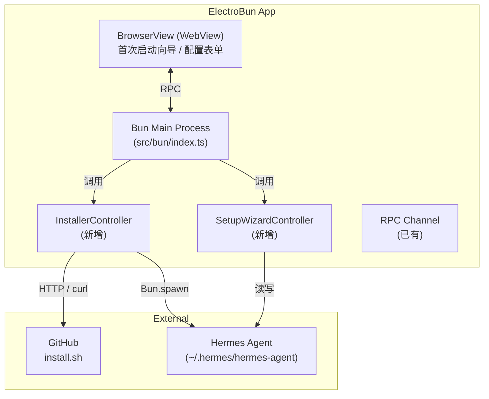
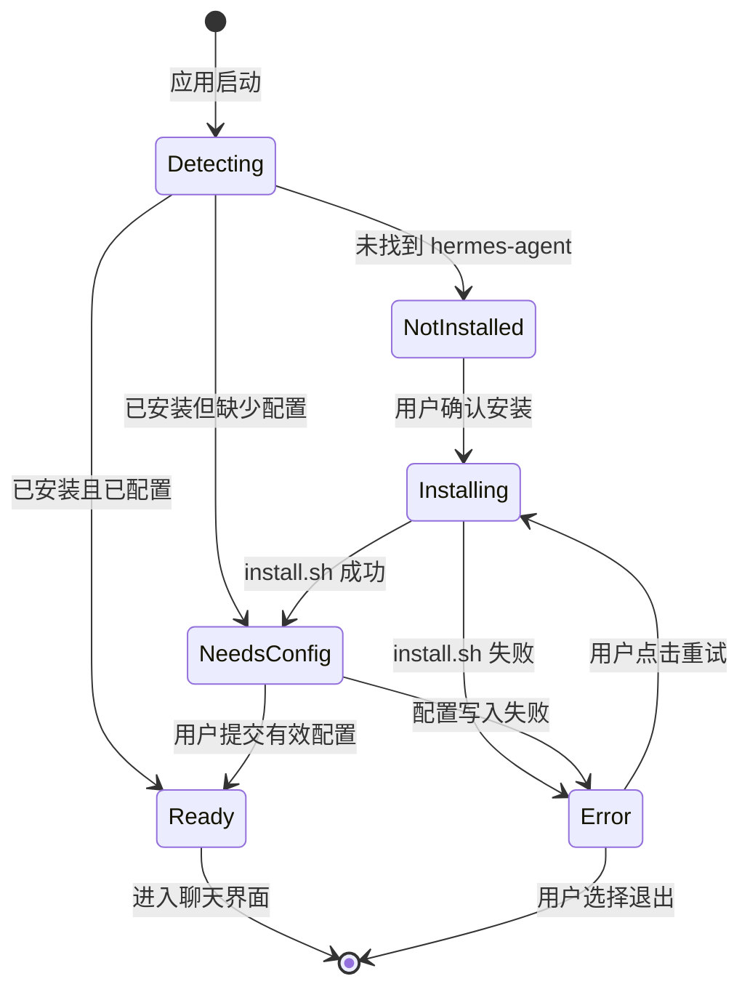

# Phase 2: Architecture（架构设计）

> **目的**: 定义系统的整体结构、组件划分和数据流  
> **输入**: Phase 1 PRD (`docs/01-prd.md`)  
> **输出物**: 填写完成的本文档，存放到 `/docs/02-architecture.md`

---

## 2.1 系统概览（必填）

### 一句话描述
一个基于 ElectroBun 的桌面 GUI 模块，能够在首次启动时自动检测、安装并图形化配置 Hermes Agent，使用户无需离开应用即可完成从"零"到"可用"的全过程。

### 产品维度评分 (借鉴 gstack CEO Review)

| 维度 | 评分 (0-10) | 什么是 10 分？ | 当前差距 |
|------|-------------|----------------|----------|
| **用户价值** | 9 | 解决"命令行恐惧"核心痛点，用户愿意为此选择 GUI 版而非 CLI 版 | 已非常接近 |
| **简洁性** | 8 | 功能最少但足够：检测、安装、配置三步 | 可再减少高级选项的默认暴露 |
| **直观性** | 9 | 用户打开应用即被引导，无需阅读文档 | 安装失败时的错误信息还可优化 |
| **可靠性** | 7 | install.sh 失败、网络中断时仍能优雅降级 | 需要更完善的回退和重试机制 |
| **性能** | 8 | 检测毫秒级，安装取决于网络，进度实时可见 | 安装包下载无法本地加速 |
| **安全性** | 7 | 默认安全：不静默执行脚本，API key 不泄露 | `curl \| bash` 仍需用户明确授权 |
| **可扩展性** | 6 | 100x 用户时，安装脚本由 GitHub 承载，无中心化瓶颈 | 但这是脚本本身的扩展性，非 GUI 模块 |
| **可维护性** | 8 | 新开发者 1 天能理解：Bun spawn + RPC + WebView 表单 | 代码结构清晰，复用现有模式 |
| **体验一致性** | 9 | 安装/配置流程的视觉风格与聊天主界面一致 | 已使用同一套 CSS/组件 |
| **情感连接** | 8 | 用户会因为"再也不用 terminals"而感到愉悦 | 彩蛋/成功动画可进一步加强 |

**平均分**: 7.9 / 10

**最高优先级改进**: **可靠性** — 需要构建安装失败时的完整回退路径（错误解析、手动指引、一键重试）。

### 架构图



### 工程审查锁定项 (借鉴 gstack Eng Review)

| 决策项 | 决定 | 理由 | 状态 |
|--------|------|------|------|
| **技术栈** | ElectroBun (Bun + WebView) + TypeScript + Python Bootstrap | 与现有项目保持一致，零迁移成本 | ✅ 已锁定 |
| **数据流模式** | Bun 主进程驱动外部安装/配置脚本，通过 RPC 将进度和结果推送到 WebView | 复用现有 `backendLog` / `backendStatus` 机制 | ✅ 已锁定 |
| **状态管理方案** | 运行时内存状态（枚举安装阶段）+ 文件系统状态（`~/.hermes-agent-gui/` 下的配置/标记文件） | 无需引入状态库，保持简单 | ✅ 已锁定 |
| **错误处理策略** | 进程退出码 + stderr 关键字匹配 → RPC 推送错误类型 → WebView 展示对应回退 UI | 分层处理：脚本级、进程级、UI 级 | ✅ 已锁定 |
| **测试策略** | Phase 5 定义：进程模拟测试 + 表单边界测试 + 集成测试（干净环境首次启动） | 受限于需要真实网络/GitHub 访问，核心逻辑优先单元测试 | ✅ 已锁定 |
| **部署方案** | 随 `hermes-agent-gui` 一起 `bun run build` 打包 | 不单独部署，作为桌面应用的一部分 | ✅ 已锁定 |
| **监控/告警方案** | 本地日志文件 (`~/.hermes-agent-gui/logs/install.log`) + DevTools Console | 桌面应用，无远程监控需求 | ✅ 已锁定 |
| **回滚策略** | install.sh 自身支持更新/覆盖已有目录；GUI 提供"卸载并重新安装"入口 | 不实现复杂的原子回滚，依赖 reinstall | ✅ 已锁定 |

## 2.2 组件定义（必填）

| 组件 | 职责 | 技术选型 | 状态 |
|------|------|----------|------|
| **BrowserView — 首次启动向导页** | 展示安装检测状态、用户确认弹窗、进度条、配置表单；收集用户输入并回传 Bun 进程 | HTML + CSS + TS (WebView) | 新建 |
| **BrowserView — 主聊天界面** | （已有）正常聊天功能；本次新增：若后端未就绪，自动跳转到向导页 | HTML + CSS + TS (WebView) | 已有/扩展 |
| **Bun Main Process (`src/bun/index.ts`)** | 应用生命周期管理；协调安装检测、安装执行、配置保存、后端启动的完整流程 | TypeScript (Bun) | 已有/扩展 |
| **InstallerController** | 检测 hermes-agent 是否存在；下载 install.sh；通过 `Bun.spawn` 执行并流式返回 stdout/stderr | TypeScript (Bun) | 新建 |
| **SetupWizardController** | 读取/写入 `~/.hermes-agent-gui/config.yaml` 和 `.env`；提供配置字段的默认值和验证 | TypeScript (Bun) + yaml 解析 | 新建 |
| **Python Bootstrap (`python/bootstrap.py`)** | （已有）启动隔离的 Hermes API Server；本次无修改 | Python 3.11 | 已有 |
| **Config Manager (`python/config_manager.py`)** | （已有）模型切换等配置辅助；本次复用 | Python 3.11 | 已有 |

### 组件边界说明
- **InstallerController 不解析配置内容**: 它只负责"把 hermes-agent 安装到本地"，配置验证交给 SetupWizardController
- **SetupWizardController 不执行 shell 脚本**: 它只负责读写配置文件和 .env
- **Bun Main Process 是唯一的协调者**: WebView 不直接调用 InstallerController，所有请求都通过 RPC 到 Bun Main Process 再分发

## 2.3 数据流（必填）

### 核心数据流：首次启动 → 安装 → 配置 → 就绪

```
用户打开 GUI
  → Bun Main Process 调用 InstallerController.detect()
  → 若未安装: WebView 展示"未检测到 Hermes，是否安装？"
  → 用户点击"安装"
  → Bun Main Process 调用 InstallerController.downloadAndRun()
  → install.sh 输出 (stdout/stderr) 通过 RPC → WebView 进度面板
  → 安装成功 → Bun Main Process 调用 SetupWizardController.checkConfig()
  → 若缺少 API key/模型: WebView 展示配置表单
  → 用户提交表单 → SetupWizardController.writeConfig()
  → Bun Main Process 调用 startBackend()
  → WebView 跳转至聊天界面
```

### 详细数据流表

| 步骤 | 数据 | 从 | 到 | 格式 |
|------|------|----|----|------|
| 1 | 安装检测结果 | `InstallerController` | `Bun Main Process` | `{ installed: boolean; path?: string }` |
| 2 | 安装确认指令 | `WebView` | `Bun Main Process` | RPC request `installHermes` |
| 3 | install.sh 输出流 | `Bun.spawn` | `WebView` | RPC message `installLog: { stream, text }` |
| 4 | 安装完成状态 | `InstallerController` | `Bun Main Process` | `{ success: boolean; error?: string }` |
| 5 | 配置缺失检测结果 | `SetupWizardController` | `Bun Main Process` | `{ needsConfig: boolean; missingFields: string[] }` |
| 6 | 配置表单字段定义 | `Bun Main Process` | `WebView` | RPC response `getSetupFields: FieldDef[]` |
| 7 | 用户提交的配置值 | `WebView` | `Bun Main Process` | RPC request `submitSetupConfig: Record<string, string>` |
| 8 | 后端健康状态 | `Bun Main Process` | `WebView` | RPC message `backendStatus: { running, port, url }` |

## 2.4 依赖关系（必填）

### 内部依赖

```
WebView (首次启动向导页)
  → RPC → Bun Main Process (src/bun/index.ts)
    → InstallerController (安装检测/执行)
    → SetupWizardController (配置读写)
    → startBackend() / stopBackend() (已有生命周期)
      → python/bootstrap.py (隔离启动 Hermes API)
        → Hermes Agent 源码 (被检测/被安装的对象)
```

### 外部依赖

| 依赖 | 版本/来源 | 用途 | 是否可替换 |
|------|-----------|------|-----------|
| `https://raw.githubusercontent.com/NousResearch/hermes-agent/main/scripts/install.sh` | 官方 main 分支 | 自动安装 hermes-agent | 可替换为本地缓存脚本或用户自定义 URL |
| GitHub (git clone) | NousResearch/hermes-agent | 下载 hermes-agent 源码 | 可替换为镜像 CDN 或本地已有仓库 |
| `Bun.spawn` | Bun ≥1.2 | 执行安装脚本 | 不可替换（项目已深度依赖 Bun） |
| `node:fs`, `js-yaml` (或原生 YAML) | Node/Bun 内置 | 读写 config.yaml | 可替换为其他 yaml 库 |

## 2.5 状态管理（必填）

### 状态枚举：安装与配置生命周期

| 状态名 | 含义 | 谁拥有 | 持久化方式 |
|--------|------|--------|-----------|
| `installState` | 当前处于检测/安装/配置/就绪/错误的哪个阶段 | Bun Main Process (内存) | 不持久化（运行时可变） |
| `installPath` | hermes-agent 实际安装路径 | Bun Main Process (内存) | 不持久化（启动时重新检测） |
| `installLogBuffer` | install.sh 的最近 500 行输出 | Bun Main Process (内存队列) | 不持久化（用于实时展示和调试） |
| `setupConfig` | 用户在向导中填写但尚未提交的临时配置 | WebView (前端状态) | 不持久化 |
| `hermesGuiConfig` | 持久化在 `~/.hermes-agent-gui/config.yaml` 的正式配置 | `SetupWizardController` | **文件系统** |
| `firstLaunchMarker` | 标记是否为首次启动（如 `.hermes-agent-gui/.gui_initialized`） | Bun Main Process | **文件系统** |

### 状态转换图



## 2.6 接口概览（必填）

> 详细定义（参数、返回值、错误码）在 Phase 3 技术规格中展开。

| 接口 | 类型 | 调用方 | 说明 |
|------|------|--------|------|
| `detectInstallation` | RPC request → response | WebView | 检测 hermes-agent 是否已安装 |
| `startInstallation` | RPC request → response | WebView | 触发 install.sh 下载与执行 |
| `cancelInstallation` | RPC request → response | WebView | 中断正在运行的 install.sh 子进程 |
| `installationStatus` | RPC message (push) | Bun → WebView | 实时推送安装状态变化 |
| `installLog` | RPC message (push) | Bun → WebView | 实时推送 install.sh 输出 |
| `getSetupFields` | RPC request → response | WebView | 获取配置表单字段定义和默认值 |
| `submitSetupConfig` | RPC request → response | WebView | 提交表单数据，写入 config.yaml/.env |
| `getBackendStatus` | RPC request → response | WebView | （已有）获取后端启动状态 |
| `restartBackend` | RPC request → response | WebView | （已有）重启 Hermes API Server |

## 2.7 安全考虑（必填）

| 威胁 | 影响 | 缓解措施 |
|------|------|----------|
| **中间人攻击：install.sh 被篡改** | 用户执行恶意脚本 | 1. 默认从官方 `raw.githubusercontent.com` 下载（HTTPS）<br>2. 提供 SHA/checksum 校验（未来扩展）<br>3. 执行前弹窗明确告知用户脚本来源并要求确认 |
| **API key 泄露** | 用户 LLM API key 被写入不安全位置 | 1. `.env` 文件权限设为 `0o600`（仅所有者读写）<br>2. `.env` 仅保存在隔离目录 `~/.hermes-agent-gui/`，不混入打包产物<br>3. WebView 表单中 API key 输入框使用 `type="password"` |
| **命令注入** | 用户通过自定义安装目录注入 shell 命令 | 1. 对自定义路径做 sanitize，拒绝包含 `;`、`\|`、`\$()` 的路径<br>2. 仅允许通过 `HERMES_AGENT_DIR` 环境变量传入，不在 UI 中开放自由输入（Phase 1 范围限制） |
| **子进程逃逸** | `Bun.spawn` 执行 install.sh 时环境变量被污染 | 1. 使用最小化的 env 传递，不继承敏感系统变量<br>2. 不在 install.sh 的参数中拼接用户输入 |

## 2.8 性能考虑（可选）

| 指标 | 目标 | 约束 |
|------|------|------|
| 安装检测耗时 | < 500ms | 只在 5-6 个固定路径做 `existsSync` |
| install.sh 下载耗时 | 取决于用户带宽 | 脚本大小约 1-2KB，可忽略；主要耗时是 git clone |
| 向导页首屏加载 | < 1s | ElectroBun WebView 加载本地 HTML，无网络依赖 |
| 配置写入响应 | < 100ms | 本地文件系统操作 |

## 2.9 部署架构（可选）

随 `hermes-agent-gui` 统一打包为 ElectroBun 桌面应用。本模块不引入新的部署单元或外部服务。

---

## ✅ Phase 2 验收标准

- [x] 架构图清晰，组件边界明确
- [x] 所有组件的职责已定义
- [x] 数据流完整，无断点
- [x] 依赖关系（内部 + 外部）已列出
- [x] 状态管理方案已定义
- [x] 接口已概览（不需要详细，那是 Phase 3 的事）
- [x] 安全威胁已识别

**验收通过后，进入 Phase 3: Technical Spec →**
