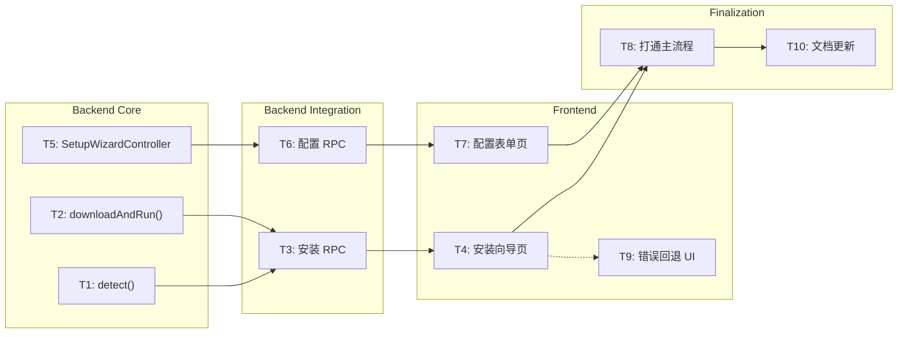

# Phase 4: Task Breakdown（任务拆解）

> **目的**: 将技术规格拆解为可执行、可分配、可验收的独立任务  
> **输入**: Phase 3 技术规格 (`docs/03-technical-spec.md`)  
> **输出物**: 任务列表，存放到 `/docs/04-task-breakdown.md`

---

## 4.1 拆解原则

1. **每个任务 ≤ 4 小时**
2. **每个任务有明确的 Done 定义**
3. **任务之间的依赖关系必须标明**
4. **先基础后上层**（按依赖顺序排列）

---

## 4.2 任务列表（必填）

| # | 任务名称 | 描述 | 依赖 | 类型 | 预估时间 | 优先级 | Done 定义 |
|---|---------|------|------|------|----------|--------|-----------|
| T1 | 实现安装检测逻辑 | 在 Bun 主进程中实现 `InstallerController.detect()`：扩展 `findHermesAgentDir()` 逻辑，增加对 `~/.hermes/hermes-agent` 的检测；返回 `InstallationDetectionResult` | 无 | 串行 | 1.5h | P0 | 单元测试通过：存在/不存在 hermes-agent 时均返回正确结果 |
| T2 | 实现安装脚本下载与执行 | 实现 `InstallerController.downloadAndRun()`：下载 install.sh，通过 `Bun.spawn` 执行，流式回调 stdout/stderr；实现 `cancel()` 发送 SIGKILL | 无 | 串行 | 2.5h | P0 | 在干净环境中跑一次：install.sh 被成功下载并执行，日志实时透传到 console |
| T3 | 集成安装 RPC 与状态机 | 在 `src/bun/index.ts` 中注册 `detectInstallation` / `startInstallation` / `cancelInstallation` RPC；实现 `installState` 内存状态机；推送 `installStatus` / `installLog` message | T1, T2 | 串行 | 2h | P0 | DevTools 中可观察到：调用 RPC 后 WebView 收到对应的 message 推送 |
| T4 | 构建前端安装向导页面 | 在 `src/mainview/` 中创建安装向导组件：展示检测状态、确认弹窗、进度条、日志滚动面板；对接 RPC `detectInstallation` / `startInstallation` / `cancelInstallation` | T3 | 串行 | 2h | P0 | 在浏览器/WebView 中可完整走通：未安装 -> 确认 -> 安装中 -> 日志展示 -> 安装成功 |
| T5 | 实现配置管理控制器 | 实现 `SetupWizardController`：读取 `~/.hermes-agent-gui/` 和 `~/.hermes/` 的现有配置；生成 `SetupFieldDefinition[]`；验证并写入 `config.yaml` + `.env`，设置 `0o600` 权限 | 无 | 串行 | 2h | P0 | 提交一组有效/无效配置，分别验证：写入成功且文件权限正确 / 返回字段级错误 |
| T6 | 集成配置 RPC | 在 `src/bun/index.ts` 中注册 `getSetupFields` / `submitSetupConfig` RPC；对接 `SetupWizardController` | T5 | 串行 | 1.5h | P0 | DevTools 中调用 RPC 可获取字段定义，提交后返回 success/errors |
| T7 | 构建前端配置表单页面 | 在 `src/mainview/` 中创建配置表单组件：动态渲染 `SetupFieldDefinition`，密码框掩码，前端基础验证；对接 RPC `getSetupFields` / `submitSetupConfig` | T6 | 串行 | 2h | P0 | 在 WebView 中可完整填写并提交配置，观察 `~/.hermes-agent-gui/config.yaml` 被更新 |
| T8 | 打通首次启动主流程 | 修改 `src/bun/index.ts` 的启动逻辑：检测 ->（未安装则跳转安装页）->（未配置则跳转配置页）-> 启动 backend -> 跳转聊天页；修改 `index.html` 入口支持路由切换 | T4, T7 | 串行 | 1.5h | P0 | 在干净环境（临时 `HERMES_HOME_GUI`）中启动 GUI，全程无命令行操作即可进入聊天界面 |
| T9 | 处理安装失败回退 UI | 在 T4 的安装向导页中增加错误状态展示：解析 `installStatus.error`，针对不同错误码展示不同提示和回退按钮（重试/手动安装指引） | T4 | 串行 | 1.5h | P1 | 模拟网络断开/install.sh 失败场景，UI 正确展示对应错误和可操作的回退按钮 |
| T10 | 添加里程碑文档和实现日志 | 更新 `docs/06-implementation-log.md`；整理代码注释；确保新增接口在 README 中有说明 | T8 | 串行 | 1h | P1 | `06-implementation-log.md` 中记录了 T1-T8 的关键决策和偏差 |

## 4.3 任务执行模式

### 串行任务
T1 → T3 → T4 → T8 为强依赖链（必须先有检测，才能集成 RPC，才能有 UI，最后才能打通流程）。
T5 → T6 → T7 → T8 为另一条强依赖链。

### 并行任务组（Coordinator 模式）
在 Milestone 1 的早期，T1、T2、T5 可并行执行：
- T1 负责 InstallerController.detect
- T2 负责 InstallerController.downloadAndRun
- T5 负责 SetupWizardController

三者互不依赖，完成后由 T3 和 T6 分别集成。

## 4.4 任务依赖图

**说明**:
- 实线箭头表示串行依赖
- T1 / T2 / T5 可在 Phase 4/5/6 实施时并行开发
- T9（错误回退 UI）依赖 T4，但可稍晚实现（P1）

## 4.5 里程碑划分

### Milestone 1: 安装检测与执行能力
**预计完成**: Phase 5 测试后进入
**交付物**: Bun 主进程能可靠检测 hermes-agent 安装状态，并通过 WebView 实时展示 install.sh 的执行进度

包含任务: **T1, T2, T3, T4**

### Milestone 2: 配置向导与全流程闭环
**预计完成**: Phase 6 实现后进入
**交付物**: 从打开应用到成功聊天的完整首次启动流程，无需用户离开 GUI 或操作终端

包含任务: **T5, T6, T7, T8**
（可选扩展: T9, T10）

## 4.6 风险识别（必填）

| 风险 | 概率 | 影响 | 缓解措施 |
|------|------|------|----------|
| install.sh 在 Bun.spawn 非交互环境中因 tty 读取失败 | 中 | 高 | 测试 `curl \| bash` 模拟环境；若失败，在 GUI 中提示用户"部分步骤需要手动执行"，并展示命令 |
| ElectroBun RPC 在 WebView 页面刷新后丢失推送消息 | 低 | 中 | 在 `dom-ready` 时主动通过 RPC 查询当前 `installState` 做状态恢复 |
| 用户已有 `~/.hermes/` CLI 配置被 GUI 意外覆盖 | 低 | 中 | 严格保持 `HERMES_HOME=~/.hermes-agent-gui` 隔离；写入前增加备份逻辑（`config.yaml.bak`） |
| GitHub 访问受限导致 install.sh 下载超时 | 中 | 中 | 支持 `HERMES_INSTALL_SCRIPT_URL` 环境变量作为镜像回退 |
| install.sh 内部安装 Node.js/Playwright 需要 sudo 导致流程中断 | 中 | 低 | 在 GUI 中捕获 stderr 并提示用户"需要输入 sudo 密码，请手动完成以下步骤" |

---

## ✅ Phase 4 验收标准

- [x] 每个任务 ≤ 4 小时
- [x] 每个任务有 Done 定义
- [x] 依赖关系已标明，无循环依赖
- [x] 至少划分为 2 个里程碑
- [x] 风险已识别

**验收通过后，进入 Phase 5: Test Spec →**
