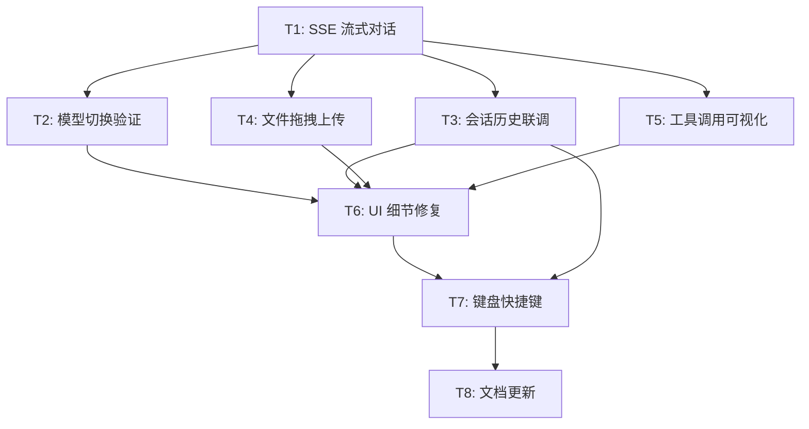

# Phase 7: Chat 端到端联调与功能硬化（任务拆解）

> **目的**: 将已搭建的聊天 UI 与 Hermes backend 真正打通，验证并修复 SSE、模型切换、会话历史、文件上传四大核心能力的端到端链路  
> **输入**: `docs/03-spec.md`（Setup 相关已完成）+ `src/mainview/index.ts`（已有 Chat UI 骨架）+ `src/bun/index.ts`（已有 RPC 与 Backend 生命周期）  
> **输出物**: 本文档 `docs/07-task-breakdown.md`，作为 Phase 7 开发的唯一入口

---

## 7.1 拆解原则

1. **每个任务 ≤ 4 小时**
2. **每个任务有明确的 Done 定义**
3. **任务之间的依赖关系必须标明**
4. **先联调后抛光**（先保证功能跑通，再修 UI 细节）

---

## 7.2 任务列表

| # | 任务名称 | 描述 | 依赖 | 类型 | 预估时间 | 优先级 | Done 定义 |
|---|---------|------|------|------|----------|--------|-----------|
| T1 | SSE 流式对话联调 | 验证 `POST /v1/runs` 创建对话 + `GET /v1/runs/{id}/events` SSE 订阅；修复事件解析、Markdown 渲染、代码块高亮；确保 assistant 消息能逐字显示 | 无 | 串行 | 2.5h | P0 | 在 GUI 中输入任意文本，10 秒内看到流式回复逐字出现，无白屏/报错 |
| T2 | 模型切换端到端验证 | 验证侧边栏 Provider + Model 修改后，调用 `setModel` RPC → backend 重启 → 新对话使用新模型；修复重启期间的 loading/错误状态 | T1 | 串行 | 1.5h | P0 | 切换模型后发送新消息，backend 日志或响应 header 中确认使用了新模型 |
| T3 | 会话历史联调 | 验证 `listSessions` / `loadSession` RPC：读取 `~/.hermes-agent-gui/sessions/sessions.json` 和 `.jsonl`；修复列表渲染、时间格式化、点击加载后聊天区回填 | T1 | 串行 | 1.5h | P0 | 侧边栏显示至少 1 条历史会话，点击后聊天区完整加载该会话的所有消息 |
| T4 | 文件拖拽上传验证 | 验证拖放文件 → base64 读取 → `saveFileUpload` RPC → 本地保存 → 文件路径附加到消息正文 → backend 接收；修复拖拽区域视觉反馈 | T1 | 串行 | 1.5h | P0 | 拖拽一个 `.txt` 文件到聊天区，发送后 backend 日志或响应中能看到该文件路径 |
| T5 | 工具调用可视化联调 | 验证 assistant 消息中的 `` `emoji ToolName` `` 标记能被正确解析为可折叠的 Tool Call 卡片；修复空工具结果/长参数的折叠显示 | T1 | 串行 | 1.5h | P1 | 触发一次工具调用（如搜索），聊天区出现折叠卡片，展开后显示完整参数 |
| T6 | UI 细节修复与体验硬化 | 修复自动滚动到底部、输入框 focus 状态、空聊天欢迎语、backend 断开时的错误提示、消息加载时的骨架屏/loading | T1-T5 | 串行 | 2h | P1 | DevTools 无报错；快速发送 3 条消息，聊天区始终自动滚动到最新内容 |
| T7 | 键盘快捷键与全局热键 | 验证 `Ctrl/Cmd+N` 新建会话、`Ctrl/Cmd+K` focus 输入框；测试全局热键 `Ctrl/Cmd+Shift+Space` 唤出窗口 | T3 | 串行 | 1h | P1 | 在任意桌面场景按下快捷键，GUI 正确响应 |
| T8 | Phase 7 集成测试与文档更新 | 更新 `docs/06-implementation-log.md` 记录 T1-T7 的偏差；补充端到端验证截图/日志；清理 `TODO` 注释 | T6, T7 | 串行 | 1h | P1 | `06-implementation-log.md` 中新增 Phase 7 章节 |

---

## 7.3 任务执行模式

### 串行主链路
T1 是所有后续任务的前置条件：**没有稳定的 SSE 对话链路，模型切换、会话历史、文件上传都无从验证**。

```
T1 (SSE 联调)
  ├── T2 (模型切换)
  ├── T3 (会话历史)
  ├── T4 (文件拖拽)
  ├── T5 (工具调用可视化)
  └── T6 (UI 硬化)
        └── T7 (快捷键)
              └── T8 (文档更新)
```

### 可并行项
T2、T3、T4、T5 在 T1 完成后可并行由不同 agent/会话处理，但单一会话建议按上表顺序执行，减少 backend 重启带来的状态干扰。

---

## 7.4 任务依赖图



---

## 7.5 里程碑划分

### Milestone 1: 核心对话链路打通（P0 闭环）
**交付物**: 用户能在 GUI 中完成一次完整的流式对话，且基础交互不崩溃。

包含任务: **T1, T2, T3, T4**

### Milestone 2: 体验硬化与收尾（P1 打磨）
**交付物**: 工具调用可视化、UI 细节、快捷键全部可用，文档更新完毕。

包含任务: **T5, T6, T7, T8**

---

## 7.6 风险识别

| 风险 | 概率 | 影响 | 缓解措施 |
|------|------|------|----------|
| Hermes `api_server.py` 的 SSE 事件格式与前端解析逻辑不匹配 | 中 | 高 | 先通过 `curl` 直连 backend 抓包，确认 event 字段名（`data` vs `content` vs `delta`）后再修前端 |
| 模型切换后 backend 旧进程未完全释放，导致端口冲突 | 中 | 中 | `stopBackend()` 增加 5s graceful shutdown + SIGKILL fallback；`startBackend()` 优先调用 `findFreePort` |
| 会话历史 `.jsonl` 格式与 `python/config_manager.py` 解析不一致 | 低 | 中 | 用真实 session 文件做样本测试，发现字段缺失时补充默认值 |
| 文件拖拽在 Linux WebView (GTK) 下无 `drop` 事件 | 低 | 中 | 若 GTK WebView 不支持 HTML5 DnD，回退为"点击上传"按钮 |
| backend 返回的工具调用标记不是 `` `emoji ToolName` ``，而是 JSON | 中 | 中 | 联调时先打印原始 assistant 消息到 Console，确认标记格式后再写正则 |

---

## ✅ Phase 7 验收标准

- [x] 每个任务 ≤ 4 小时
- [x] 每个任务有 Done 定义
- [x] 依赖关系已标明，无循环依赖
- [x] 至少划分为 2 个里程碑
- [x] 风险已识别

**验收通过后，进入 Phase 7 Implementation →**
